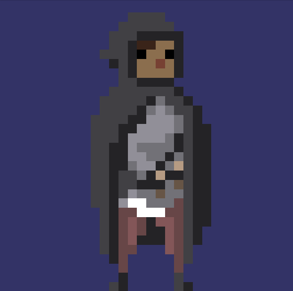

# Simple sprite animation with legacy OpenGL

<p align="center">
  
</p>


Simple example of sprite animation with legacy OpenGL

# Use

After compile, run the executable ./AnimatedSprit
To change the animation, use ```j``` to decrease the index and ``` k``` to increase it.

## Dependences

- [Freeglut](http://freeglut.sourceforge.net/)
- [stb_image](https://github.com/nothings/stb)

If you use Windows, I recommend use [MSYS2](https://www.msys2.org/) to compile the code in unix-like environment.

## Third party resource

Sprite image by: <https://opengameart.org/>
